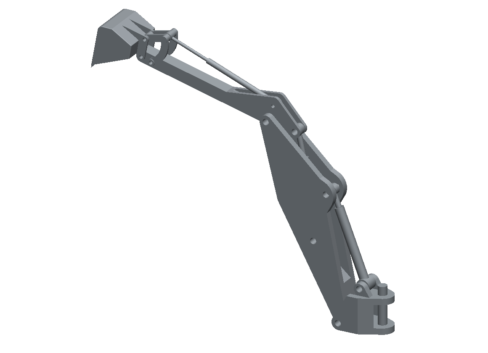

# Convert your first model

Rather than start on your own detector, it is worth converting something small and known-good first,
so that anything odd later is clearly your model and not your installation. A toy excavator arm is
committed to the repository for exactly this purpose:

```text
$O2_ROOT/share/CADSupport/examples/ExcavatorArm.step   # 13 leaf solids, ~500 kB
```

It converts in seconds and is varied enough to be interesting: the hydraulic rams and pivot pins are
plain cylinders, the boom and stick are machined bodies full of concave features, and the bucket has
a torus in it. Run the converter over it, asking for all three representations at once — we come back
to what those are in the next section:

```bash
mkdir -p cad_out/excavator
o2-cad-to-tgeo \
    $O2_ROOT/share/CADSupport/examples/ExcavatorArm.step \
    --output-folder cad_out/excavator \
    -o geom.C \
    --step-unit auto \
    --csg auto --exact-surfaces auto --mesh --mesh-prec 0.05
```

That takes about thirteen seconds. Along the way the converter prints three lines worth reading on
*every* run, because each one catches a different common mistake:

```text
Detected STEP length unit: mm (scale to cm = 0.1)
Placement check: 13 leaf placement(s), all at distinct world transforms.
Emitting 13/13 logical volumes as exact O2BVHSurfaceSolid
```

The unit line bites hardest. TGeo works in centimetres and most CAD systems export millimetres, so a
silent unit error gives you a detector ten times too big and a simulation that still looks almost
plausible. `--step-unit auto` reads the declaration in the file; pass `--step-unit mm` explicitly when
the file declares something you do not believe. The placement line then tells you whether two leaves
landed on the same world transform, which almost always means a duplicated part in the CAD model
rather than a real coincidence.

Finally the converter prints what it decided for each part, ending in a one-line summary:

```text
=== REPRESENTATION CASCADE (per leaf solid) ===
  volume                carried by  evidence
  BasePin               csg         TGeoTube(rmin=0, rmax=1, dz=5) [tier1-tube], dV_sym=0 cm^3
  Base                  surface     declined CSG: 7 axis clusters: beyond the recogniser's scope ...
  BoomCylinderOuter     csg         TGeoTube(0.6,1,7.991) u TGeoTube(0.7,1.5,1.5), dV_sym=0 cm^3
  ...
  tiers: CSG 7, exact surfaces 6, tessellated 0  (of 13 leaf solids)
```

Seven parts came out as ordinary ROOT shapes, six as exact surface solids, and none had to fall back
to an approximate mesh. The `dV_sym=0` is the reassuring part: it is the symmetric-difference volume
between what was emitted and the original CAD solid, so zero means the conversion is exact rather
than merely close.

## Look at what you made

Numbers in a terminal are no substitute for seeing the thing. The macro can build the geometry and
write it out as an ordinary ROOT file:

```bash
cd cad_out/excavator
root -l -b -q -e '.L geom.C' -e 'build_and_export("geom.root");'
```



*The converted model, drawn by casting one ray per pixel through the TGeo navigator — so this is the
geometry as the transport sees it, not a separate preview mesh.*

The simplest interactive way to inspect the result is ROOT's own web display, which renders the
geometry with JSROOT in your browser and lets you rotate it, hide volumes and click through the tree:

```bash
root --web geom.root
```

If you are on a remote machine where opening a browser is awkward, export the geometry as a JSROOT
document instead and open that file locally. It is a self-contained 32 kB for this model, and can be
dragged straight onto [root.cern/js](https://root.cern/js/):

```bash
root -l -b -q -e 'TGeoManager::Import("geom.root");' \
             -e 'TBufferJSON::ExportToFile("excavator.json.gz", gGeoManager);'
```

Spend a minute here. Turning the model around is the fastest way to notice that a subassembly is
missing, that something sits at the wrong scale, or that the part you care about was quietly filtered
out.
