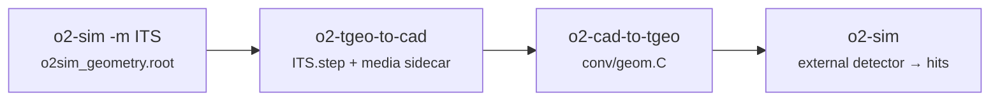

# The ITS, out and back again

Everything so far started from a CAD file. This example starts from ALICE itself: we take the ITS as
O2 builds it, export it to STEP, convert it back, and simulate hits in the result. It is the most
realistic thing you can do with the tools, because the answer is known — the same detector,
transported by the same Geant, is sitting right next to it.

It is also the standard way of testing the converter on a part you do not have a CAD file for. Any
O2 module works the same way.

The four steps are:



## 1 · The source geometry

`-n 0` builds the geometry, writes it and transports nothing:

```bash
mkdir -p its_roundtrip && cd its_roundtrip
o2-sim-serial -n 0 -g boxgen -m ITS -o o2sim
```

That leaves `o2sim_geometry.root`, which is the input to the export.

## 2 · TGeo to STEP

```bash
o2-tgeo-to-cad o2sim_geometry.root ITS.step \
    --top barrel \
    --hollow-volume barrel --hollow-tag ITS \
    --media-json ITS_media.json \
    --report ITS_writer_report.json
```

```text
Step File Name : ITS.step(278254 ents)  Write  Done
261 solids, 84 volumes with daughters, 29 pure assemblies, 1996 components, 2 volumes declined
capacity check: max relative deviation 2.012e-02, median 3.365e-16
report: ITS_writer_report.json   (28.22 s, 16.17 MB)
media:  ITS_media.json   (33 media over 261 parts)
```

Three of those options deserve a word.

`--top barrel` converts the subtree under `barrel`, which is where `o2-sim` hangs the ITS. Converting
from the world root instead would drag the experiment hall along with it.

`--hollow-volume barrel` emits `barrel` as a pure assembly: its daughters keep their own transforms,
but the volume itself contributes no body. This matters because `o2-sim` always builds `cave`,
`barrel` and `caveRB24` itself, whatever module list it is given — shipping a second copy would put
two coincident air boxes in the world. `--hollow-tag ITS` then suffixes the hollowed name, so two
modules exported from the same world do not collide when they are placed together.

`--media-json` is the sidecar that makes this a *round trip* rather than a one-way conversion. It
records every medium as O2 built it, so the back-conversion can rebuild them verbatim instead of
guessing materials from part names.

The `capacity check` line is the writer's own verification: it compares the volume of each solid it
wrote against the volume ROOT reports for the original shape. A median deviation of 3.4e-16 is machine
precision.

## 3 · STEP back to TGeo

```bash
o2-cad-to-tgeo ITS.step -o geom.C --output-folder conv \
    --csg auto --exact-surfaces auto --mesh \
    --media-json ITS_media.json
```

This one takes about five minutes — the ITS is 261 solids, several of which are deep boolean
constructions.

```text
Detected STEP length unit: mm (scale to cm = 0.1)
Placement check: 296716 leaf placement(s), all at distinct world transforms.
  tessellation is EXACT (every face a planar polygon) for 142 of 261 part(s) -- 54.4 %
  tiers: CSG 252, exact surfaces 9, tessellated 0  (of 261 leaf solids)
Media from sidecar: 261/261 volumes carry their source medium
Wrote ROOT macro: .../conv/geom.C
```

Two lines to read carefully. `tiers: CSG 252, exact surfaces 9, tessellated 0` says the whole ITS came
back exactly: 252 parts as ordinary ROOT shapes, nine as exact surface solids, and nothing at all fell
through to the approximate mesh. `Media from sidecar: 261/261` says every volume got its original
medium back rather than a placeholder.

You can check the media independently:

```bash
python3 $O2_SRC/Detectors/CADSupport/validation/closure/check_media.py \
    --original o2sim_geometry.root --macro conv/geom.C --rtol 1e-6 \
    --writer-report ITS_writer_report.json
```

```text
converted volumes with a medium: 261
  media identical to the source: 261
  left on the Default placeholder (transparent): 0
  disagreeing with the source: 0
VERDICT: every volume carries its source medium
```

> [!NOTE]
> **One shell or two**
>
> The converter and `o2-sim` share one `alienv enter O2sim/latest,pythonOCC/latest` shell. If your
> `pythonOCC` modulefile still has the `PYTHONPATH` defect described in
> [Install the software](install.md), that same path makes `o2-sim` segfault at startup — run the
> converter in a shell of its own until the modulefile is fixed.

## 4 · Hits from the converted ITS

Now hook it in. The sensitive volumes are the seven ITS sensor volumes, `ITSUSensor0` … `ITSUSensor6`,
which one substring selects. Because the geometry was converted from `barrel` with `barrel` hollowed,
it goes back into the real `barrel` with no placement at all — every part lands at exactly the
transform the source geometry gave it:

`externalGeometry.json`

```json
{
  "externalDetectors": [
    {
      "name": "CITS",
      "title": "CAD round-tripped ITS",
      "macro": "conv/geom.C",
      "anchor": "barrel",
      "detID": "ITS",
      "sensitiveVolumes": ["ITSUSensor"]
    }
  ]
}
```

`detectorlist.json`

```json
{ "CADITS": ["CITS"] }
```

```bash
o2-sim-serial -n 3 -g boxgen --seed 42 \
    --detectorList CADITS:detectorlist.json \
    --extGeomFile externalGeometry.json \
    --configKeyValues 'SimCutParams.trackSeed=true;BoxGun.number=100;BoxGun.pdg=211;BoxGun.eta[0]=-1;BoxGun.eta[1]=1;BoxGun.prange[0]=2.0;BoxGun.prange[1]=5.0'
```

```text
External detector CITS: 7 sensitive volume(s) selected
External detector CITS: registered sensitive volume 'ITSUSensor0' (MC volID 13, sensor 0)
External detector CITS: registered sensitive volume 'ITSUSensor1' (MC volID 61, sensor 1)
...
External detector CITS: registered sensitive volume 'ITSUSensor6' (MC volID 264, sensor 6)
CREATING BRANCH CITSHit
External detector CITS EndOfEvent: 1825 sensitive step(s) -> 849 hit(s)
External detector CITS EndOfEvent: 1862 sensitive step(s) -> 887 hit(s)
External detector CITS EndOfEvent: 1754 sensitive step(s) -> 869 hit(s)
```

The ITS that came back from CAD is producing hits, on the `ITS` DetID slot, in a branch called
`CITSHit`. No detector class was written and nothing was recompiled.

## Is it the same detector?

The cheapest answer is the radius of the hits. Run the native ITS with the same gun and the same seed

```bash
o2-sim-serial -n 3 -g boxgen --seed 42 -m ITS -o native \
    --configKeyValues 'SimCutParams.trackSeed=true;BoxGun.number=100;BoxGun.pdg=211;BoxGun.eta[0]=-1;BoxGun.eta[1]=1;BoxGun.prange[0]=2.0;BoxGun.prange[1]=5.0'
```

and histogram the hit radius on both sides:

```cpp
sqrt(ITSHit.mPos.fCoordinates.fX**2 + ITSHit.mPos.fCoordinates.fY**2)   // native, in native_HitsITS.root
sqrt(CITSHit.mPos.fCoordinates.fX**2 + CITSHit.mPos.fCoordinates.fY**2) // CAD,    in o2sim.root
```

| r (cm) | 1.9 | 2.6 | 3.4 | 4.1 | 19.1 | 19.9 | 24.4 | 25.1 | 34.1 | 34.9 | 38.6 | 39.4 |
| --- | --- | --- | --- | --- | --- | --- | --- | --- | --- | --- | --- | --- |
| native | 14 | 158 | 171 | 185 | 69 | 201 | 265 | 73 | 273 | 101 | 58 | 299 |
| CAD | 74 | 270 | 346 | 362 | 166 | 207 | 348 | 53 | 197 | 187 | — | 395 |

Every populated radius is populated on both sides, and no hit appears anywhere else: the three inner
barrel layers and the four outer ones are exactly where the native ITS puts them, to the bin. That is
the geometry check, and it passes.

The *counts* are not the same, and should not be read as one. The two runs are not on identical
physics: a module loaded through the JSON mechanism has no detector directory and therefore no
`simcuts.dat`, so its production cuts are not the ones the ITS sets for itself, and it makes more
low-energy secondaries. Carrying the cuts across takes a cut dump from the baseline, a probe run to
learn the CAD run's own medium indices, and a remap by medium name — which is exactly what
`validation/closure/` does:

```bash
$O2_SRC/Detectors/CADSupport/validation/closure/run_closure.sh <studydir>
```

It runs PIPE, ITS, TPC and MAG through the same round trip, remaps the cuts, and then compares hits
and material budget between the two sides properly. Use it when you need a number; use the radius
histogram above when you need to know, in a minute, that your geometry arrived where it should.
