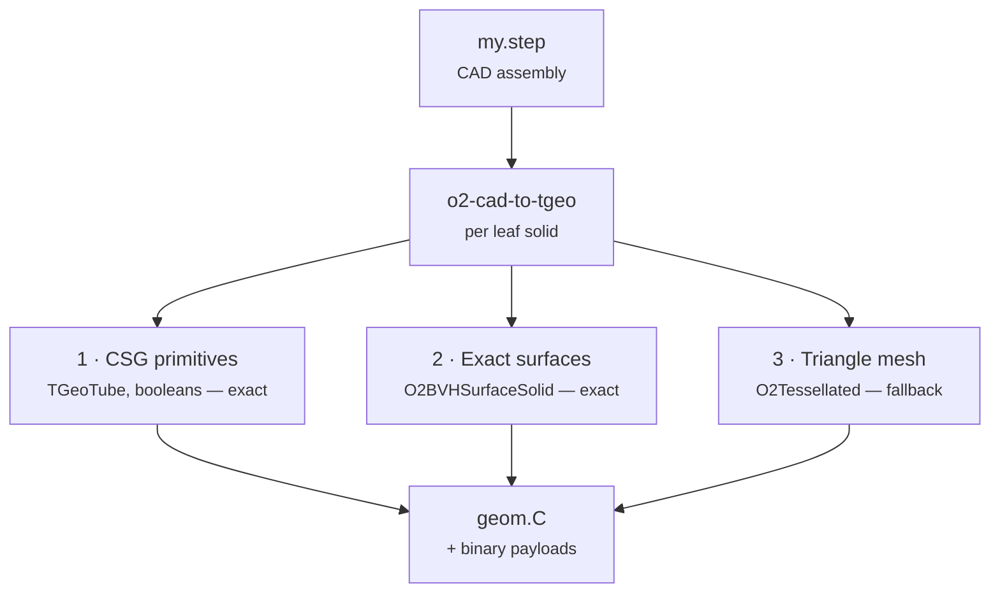
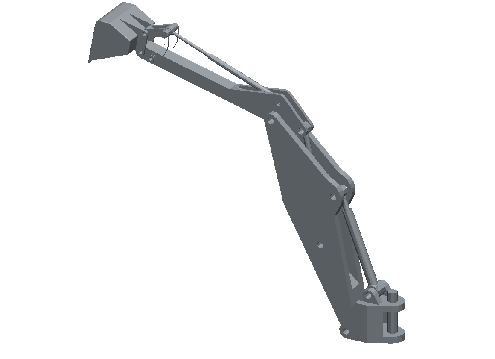
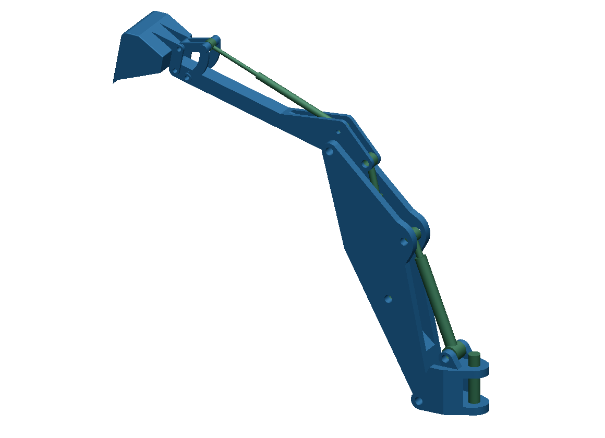

# How a part is represented

You have just run a conversion where every part came out exact, which is a good outcome but not an
automatic one. It is worth understanding what the converter was choosing between, because on a real
detector those choices decide both how faithful your simulation is and how fast it runs.

The difficulty is that CAD and TGeo describe solids in different languages. CAD describes a body by
its boundary surfaces — this face is a piece of a cylinder, trimmed by these curves. TGeo describes a
body by combining primitives — a tube minus a box, say. Neither language is a superset of the other,
so there is no single translation that always works. The converter therefore carries three different
answers and picks the best available one **for each leaf solid independently**.

The three are complementary rather than competing, and all of them end up in the same `geom.C`.
Nothing is ever lost along the way: a part that resists exact description still ships as a mesh, so a
conversion always produces a complete geometry.

| Tier | What it is | Exact | Covers | Flag |
| --- | --- | --- | --- | --- |
| **CSG** | Native ROOT shapes — `TGeoTube`, `TGeoBBox`, `TGeoCone` and booleans of them | Yes | Mechanical parts that really are primitives. Fastest to navigate and smallest on disk, so it is tried first. | `--csg auto` |
| **Surfaces** | The part's real trimmed boundary faces carried into TGeo as `O2BVHSurfaceSolid`, with a bounding-volume hierarchy for ray queries | Yes | Anything whose faces are planes, cylinders, cones, spheres or tori, however complicatedly trimmed. | `--exact-surfaces auto` |
| **Mesh** | A triangle mesh as `O2Tessellated` | No | Everything else, as the fallback. Genuinely free-form surfaces end up here. | `--mesh` |

The difference is easiest to see rather than describe. Below, the same model is converted twice: once
to triangles alone at a coarse tolerance, and once with the full cascade, coloured by which tier
carried each part.

| Tessellated only | The cascade, by tier |
| --- | --- |
|  |  |

On the left the cylinders have visibly polygonal silhouettes and flat shading bands — that is the
approximation you are accepting. On the right the rams and pivot pins were recognised as unions of
tubes and the machined bodies carried as their exact trimmed surfaces, so the curves are curves. Both
images are cast through the TGeo navigator with the same camera.

In practice one asks for all three and lets the converter decide, which is what the `auto` values in
the earlier command did. Each of `--csg` and `--exact-surfaces` accepts three settings, and the third
is more useful than it looks:

- `off` — never use this tier. This is the default for both, so a bare conversion gives you meshes
  only, which is the left-hand picture above.
- `auto` — use it wherever it is accepted, and fall through quietly elsewhere.
- `required` — stop with a report if any part cannot be represented this way. Use it when you want to
  *know* your geometry is exact rather than hope so.

One thing to trust here: a part is only accepted as CSG when OpenCascade's symmetric-difference volume
against the original solid falls inside the model's own tolerance. The recogniser is never allowed to
be approximately right, which is why `dV_sym=0` keeps appearing in the evidence column.

## Mesh precision, and one way to fill a disk

When a part does fall through to the mesh tier, `--mesh-prec` sets both the linear deflection (in
model units) and the angular deflection (in radians) of the mesher: lower is finer and slower. For a
desk-scale part `0.05` is a reasonable default. For anything metre-scale you should be careful,
because the cost grows quickly with size — the default `0.1` applied to a two-metre sphere has
produced a **22.9 GB** output directory. The right move for large models is to leave `--mesh` off
entirely and let the two exact tiers carry them.

> [!WARNING]
> **`--mesh-solid tgeo` does not navigate**
>
> The mesh tier defaults to `--mesh-solid o2`, which emits `o2::base::O2Tessellated` and needs the
> O2 environment to load. The alternative, `--mesh-solid tgeo`, emits ROOT's own `TGeoTessellated`,
> which implements none of `Contains`, `DistFromInside`, `DistFromOutside` or `Safety`. Every such
> volume is then transported as its **filled bounding box**, silently and with no warning. Only
> reach for it when the macro must load outside O2 and will never have a particle sent through it.
